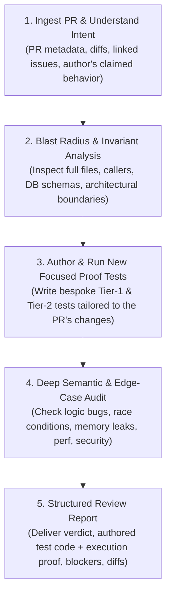

# PR Review & Active Proof Verification Skill

This skill provides an end-to-end runbook for reviewing Pull Requests (PRs) and feature branches with **authoring new, focused Tier-1 and Tier-2 tests**.

Instead of passively reading diffs or relying solely on pre-existing generic tests, this skill mandates that you **author and run new targeted test scenarios** tailored specifically to the PR's claimed fixes or features to *prove* they work with real state and real Qt widgets before delivering your verdict.

---

## 🧭 The 5-Phase Review Protocol



---

## 🛠️ Phase 1: Ingest PR Context & Changes

### A. If Reviewing a GitHub PR (`gh pr`)
```bash
# 1. Fetch PR overview, title, description, and base/head branches:
gh pr view <PR_NUMBER> --json title,body,author,baseRefName,headRefName,statusCheckRollup

# 2. Inspect changed files summary & full diff:
gh pr diff <PR_NUMBER> --name-only
gh pr diff <PR_NUMBER>

# 3. Check out the PR branch locally for testing:
gh pr checkout <PR_NUMBER>
```

### B. If Reviewing a Local Feature Branch
```bash
# Compare current branch against base branch:
git fetch origin main
git diff --stat origin/main...HEAD
git diff origin/main...HEAD
```

### C. Automated Blast Radius Triage
Run the triage helper to categorize touched files by subsystem and risk:
```bash
python .agents/skills/pr-reviewer/scripts/fetch_pr_context.py --pr <PR_NUMBER>
# or for local branch:
python .agents/skills/pr-reviewer/scripts/fetch_pr_context.py --local
```

---

## 🔬 Phase 2: Blast Radius & Architectural Invariants

Never judge a diff in isolation. Inspect surrounding code and verify repo invariants:

1. **Read Complete Files**: Open all modified files with `view_file` to understand types, lifecycle, and assumptions.
2. **Trace Callers & Dependents**: Use `grep_search` to find all call sites of modified functions or mutated fields.
3. **Audit Against Architecture Invariants** (see `references/ankimon_invariants.md`):
   - **Headless Core Seam**: Core modules (`battle_loop`, `functions/`, `business.py`, `database_manager.py`) must never import `aqt` or `PyQt6` at top level.
   - **Database Compatibility**: Schema changes must migrate cleanly without corrupting existing user databases.
   - **Form ID Resolution**: Mega/Gmax/alternate IDs $\ge 10000$ must resolve to base species via `check_id_ok()` before dex or gen-toggle checks.
   - **Review Hot-Path Safety**: No synchronous disk I/O (`json.load(open(...))`) in card review loops.
   - **Encounter DAG**: Prerequisite trees must be strictly acyclic.

---

## 🧪 Phase 3: Author & Execute Tailored Proof Tests

> [!IMPORTANT]
> **Do not just run existing test suites.** You must formulate a test hypothesis based on what the PR claims to do, and **author a new, focused test** to prove it!

### Step 3.1: Formulate the Test Hypothesis
Identify the core claim of the PR:
- *Claim:* "Fixes move replacement in PC Box when a Pokemon has 4 moves."
- *Claim:* "Calculates correct experience curve when battling Gen 9 wild Pokemon."
- *Claim:* "Adds a new toggle in Settings dialog and persists it across reboots."
- *Claim:* "Updates WebShell LiveUpdateBridge when gold/cash changes."

---

### Step 3.2: Author a New Focused Tier-2 Test (Real Qt Widgets & Offscreen UI)

When the PR modifies Qt windows, dialogs, PC box, Settings, WebShell, or reviewer shortcuts, **author a new Tier-2 test** that drives genuine PyQt6 widgets in offscreen mode.

Create a new test file (e.g. `tests/proofs/test_pr_<PR_NUMBER>_tier2.py` or a standalone script using `templates/tier2_proof_template.py`):

```python
"""
Focused Tier-2 proof test for PR #<PR_NUMBER>:
Tests that <FEATURE/BUGFIX> works with real Qt widgets and persists to DB.
"""
import os
import sys

REPO_ROOT = os.path.dirname(os.path.dirname(os.path.dirname(os.path.abspath(__file__))))
if REPO_ROOT not in sys.path:
    sys.path.insert(0, REPO_ROOT)

from harness.real_driver import RealDriver
from PyQt6.QtWidgets import QPushButton, QLineEdit
from PyQt6.QtTest import QTest

def run_proof():
    # 1. Boot genuine add-on with offscreen Qt and seeded state
    d = RealDriver(seed={
        "main": {"species": "Pikachu", "level": 25},
        "box": [{"species": "Gengar", "level": 50, "moves": ["Shadow Ball", "Sludge Bomb", "Thunderbolt", "Hypnosis"]}],
    })
    app = d.app
    db = d.services.db
    pc = d.services.pc_box_window

    # 2. Drive the real UI feature as a user would
    iid = db.get_all_pokemon()[0]["individual_id"]
    pkmn = db.get_pokemon(iid)
    pc.show_pokemon_details(pkmn)
    app.processEvents()

    # 3. Find real widgets and simulate user input
    # (e.g. click button, change text, trigger dialog action)
    # ...

    # 4. Assert real database state and event emissions
    events = d.drain_events()
    assert not any(e.get("type") == "error" for e in events), "No UI/Qt errors fired"
    
    print("✅ Tier-2 Proof PASSED: Real Qt feature interaction verified and state persisted.")
    return True

if __name__ == "__main__":
    run_proof()
```

Run your new Tier-2 proof:
```bash
# In offscreen Qt environment:
source .tier2/env.sh
python path/to/your_tier2_proof.py
```

---

### Step 3.3: Author a New Focused Tier-1 Test (Core Logic & Battle Loop)

When the PR touches battle mechanics, encounters, leveling, items, or business logic, author a fast, zero-dependency Tier-1 test:

```python
"""
Focused Tier-1 proof test for PR #<PR_NUMBER>:
Tests <SPECIFIC_LOGIC_CHANGE>.
"""
from harness.driver import Driver

def run_proof():
    # 1. Seed exact initial conditions matching the PR scenario
    d = Driver(seed={
        "main": {"species": "Charizard", "level": 36},
        "items": {"Pokeball": 10},
    })

    # 2. Drive the specific affected mechanic
    d.set_enemy(species="Pikachu", level=20)
    d.answer("good")  # simulates card review / turn action

    # 3. Observe event stream and assert state invariants
    events = d.drain_events()
    state = d.get_state()

    assert state["main"]["hp"] > 0, "Main HP must be valid"
    assert any(e["type"] == "battle" for e in events), "Expected battle event"
    print("✅ Tier-1 Proof PASSED: Domain logic behaves correctly.")
    return True

if __name__ == "__main__":
    run_proof()
```

---

### Step 3.4: Baseline Regression Suite
After proving the new change with your bespoke tests, confirm that baseline suites still pass:
```bash
python harness/check.py
pytest tests/test_addon_integrity.py
```

---

## 🔎 Phase 4: Deep Semantic Audit Checklist

Review the full diff across 5 critical dimensions (see `references/review_checklist.md`):

| Dimension | Critical Questions to Verify |
| :--- | :--- |
| **1. Functional Correctness** | Are boundary conditions handled (0, `None`, empty lists)? Are off-by-one errors present? Does error handling cleanly recover? |
| **2. Concurrency & State** | Are shared singleton mutations thread-safe? Do background workers (`QueryOp`) update UI solely on the main thread? |
| **3. Performance & Memory** | Are there unclosed event listeners, memory leaks in Qt widgets, or N+1 queries in loops? |
| **4. Security & Safety**| Is input sanitized before SQL execution or WebEngine DOM injection (`live` bridge)? |
| **5. Test Quality** | Does the PR include adequate test coverage? Did your bespoke proof pass cleanly? |

---

## 📋 Phase 5: Deliver the Structured Review Report

Format the final review report with the newly authored test and proof output:

```markdown
## 📋 PR Review: [PR Title] (#[PR Number])

### 🔍 Executive Summary & Impact Assessment
- **Summary**: [Concise 1-2 sentence description of what this PR does]
- **Risk Level**: [Low | Medium | High | Critical]
- **Affected Subsystems**: [e.g. PC Box UI, SQLite DB, Battle Loop]

---

### 🧪 Bespoke Proof Verification (Authored Tier 1/2 Tests)
> We authored a focused test scenario specifically to prove the changes in this PR:

**Authored Test Scenario (`proof_scenario.py`)**:
```python
# [Insert the Python proof test you authored]
```

**Proof Execution Output**:
```text
[Paste the terminal output from running your authored test]
✅ Tier-2 Proof PASSED: Real Qt widget interaction verified cleanly.
```

- [x] **Baseline Regression Gate**: `python harness/check.py` — **PASSED** (0 failures).
- [x] **Module Integrity**: `pytest tests/test_addon_integrity.py` — **PASSED**.

---

### 🚨 Critical / Blocker Issues (Must Fix Before Merge)
*(If none, state "None detected.")*

- **[Issue Title]**
  - **Location**: [`path/to/file.py:L45-L52`](file:///path/to/file.py#L45-L52)
  - **Root Cause**: [Explain why this causes a bug, crash, or invariant violation]
  - **Failure Mode**: [What happens at runtime if this is not fixed]
  - **Suggested Fix**:
    ```diff
    - faulty_code()
    + corrected_code()
    ```

---

### 💡 Suggestions & Polish (Non-Blocking)
- **[Suggestion Title]**
  - **Location**: [`path/to/file.py:L110`](file:///path/to/file.py#L110)
  - **Note**: [Optimization, edge case consideration, or documentation tip]

---

### 🏁 Final Verdict
- [ ] **Approve (Ready to Merge)**
- [ ] **Approve with Minor Suggestions**
- [ ] **Request Changes (Blockers Identified)**
```
