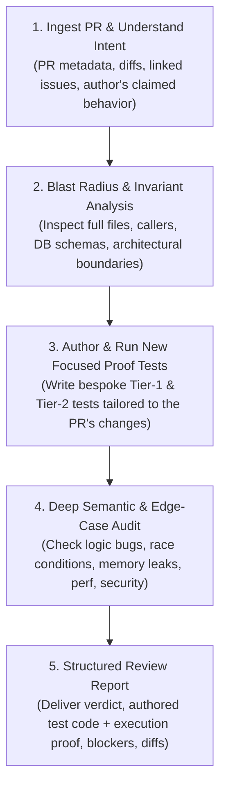

# PR Review & Active Proof Verification Skill

This skill provides an end-to-end runbook for reviewing Pull Requests (PRs) and feature branches with **authoring new, focused Tier-1 and Tier-2 tests**.

Instead of passively reading diffs or relying solely on pre-existing generic tests, this skill mandates that you **author and run new targeted test scenarios** tailored specifically to the PR's claimed fixes or features to *prove* they work with real state and real Qt widgets before delivering your verdict.

---

## 🧭 The 5-Phase Review Protocol



---

## 🛠️ Phase 1: Ingest PR Context & Changes

### A. If Reviewing a GitHub PR (`gh pr`)
```bash
# 1. Fetch PR overview, title, description, and base/head branches:
gh pr view <PR_NUMBER> --json title,body,author,baseRefName,headRefName,statusCheckRollup

# 2. Inspect changed files summary & full diff:
gh pr diff <PR_NUMBER> --name-only
gh pr diff <PR_NUMBER>

# 3. Check out the PR branch locally for testing:
gh pr checkout <PR_NUMBER>
```

### B. If Reviewing a Local Feature Branch
```bash
# Compare current branch against base branch:
git fetch origin main
git diff --stat origin/main...HEAD
git diff origin/main...HEAD
```

### C. Automated Blast Radius Triage
Run the triage helper to categorize touched files by subsystem and risk:
```bash
python .agents/skills/pr-reviewer/scripts/fetch_pr_context.py --pr <PR_NUMBER>
# or for local branch:
python .agents/skills/pr-reviewer/scripts/fetch_pr_context.py --local
```
A nonzero exit means context retrieval failed; do not interpret it as an empty or low-risk diff.

---

## 🔬 Phase 2: Blast Radius & Architectural Invariants

Never judge a diff in isolation. Inspect surrounding code and verify repo invariants:

1. **Read Complete Files**: Open all modified files with `view_file` to understand types, lifecycle, and assumptions.
2. **Trace Callers & Dependents**: Use `grep_search` to find all call sites of modified functions or mutated fields.
3. **Audit Against Architecture Invariants** (see `references/ankimon_invariants.md`):
   - **Headless Core Seam**: Core modules (`battle_loop`, `functions/`, `business.py`, `pyobj/database_manager.py`) must remain importable without Anki/Qt; guard or lazy-load GUI imports.
   - **Database Compatibility**: Schema changes must migrate cleanly without corrupting existing user databases.
   - **Form ID Resolution**: `check_id_ok()` returns a generation-enabled boolean, not a species ID. Preserve actual form IDs for form-aware Pokédex lookups; obtain the base `species_id` from Pokédex data when the caller requires it.
   - **Review Hot-Path Safety**: No synchronous disk I/O (`json.load(open(...))`) in card review loops.
   - **Encounter DAG**: Prerequisite trees must be strictly acyclic.

---

## 🧪 Phase 3: Author & Execute Tailored Proof Tests

> [!IMPORTANT]
> **Do not just run existing test suites.** You must formulate a test hypothesis based on what the PR claims to do, and **author a new, focused test** to prove it!

### Step 3.1: Formulate the Test Hypothesis
Identify the core claim of the PR:
- *Claim:* "Fixes move replacement in PC Box when a Pokemon has 4 moves."
- *Claim:* "Calculates correct experience curve when battling Gen 9 wild Pokemon."
- *Claim:* "Adds a new toggle in Settings dialog and persists it across reboots."
- *Claim:* "Updates WebShell LiveUpdateBridge when gold/cash changes."

---

### Step 3.2: Author a New Focused Tier-2 Test (Real Qt Widgets & Offscreen UI)

When the PR modifies Qt windows, dialogs, PC box, Settings, WebShell, or reviewer shortcuts, author a Tier-2 test using real offscreen Qt widgets.

Start from the executable [Tier-2 template](templates/tier2_proof_template.py):
```bash
python .agents/skills/pr-reviewer/scripts/run_proof_scenario.py --init-tier2 tests/proofs/proof_pr_818_tier2.py
source .tier2/env.sh
python tests/proofs/proof_pr_818_tier2.py
```
Use the PR number being reviewed in the filename. The template demonstrates a real rename and checks the resulting SQLite record. Adapt its fixture, interaction, and assertions to the PR's claim; passing the unchanged rename sample proves only that sample.

`RealDriver` has no `seed=` argument. For a collection-only fixture, boot a throwaway session, construct a Pokemon with `harness.fixtures.build_pokemon`, and save it through `d.services.db`. Access the application through `d.env.app` and the PC through `d.services.pokemon_pc`. If a scenario needs a live main Pokemon, initialize the live state as well as its DB record using the existing harness APIs.

For WebEngine changes, use `RealDriver(webengine=True, require_webengine=True)` so a missing Chromium dependency cannot silently fall back to a stub.

### Step 3.3: Author a New Focused Tier-1 Test (Core Logic & Battle Loop)

For battle mechanics, encounters, leveling, items, and business logic, start from the [Tier-1 template](templates/tier1_proof_template.py). It needs `requests` and the initialized poke-engine submodule, but not Anki or Qt:
```bash
python .agents/skills/pr-reviewer/scripts/run_proof_scenario.py --init-tier1 tests/proofs/proof_pr_818_tier1.py
python .agents/skills/pr-reviewer/scripts/run_proof_scenario.py --file tests/proofs/proof_pr_818_tier1.py
```
The runner imports a trusted module and requires a callable `run_proof()` that returns `True` after its assertions. It rejects missing entry points, exceptions, and other return values. It does not run pytest test functions or a script's `__main__` block. Run those with pytest or Python directly. Proof code has normal Python access to the environment; inspect code from a PR before executing it.

Both templates discover the checkout from their parent directories or the working directory. Keep proofs inside the checkout, or run external proof files from the checkout root. Scaffolding refuses to overwrite an existing file.

**Keep action results:** `Driver.answer()`, `set_enemy()`, `catch()`, `defeat()`, and the equivalent `RealDriver` actions return and drain their events. Accumulate those returned lists. Only call `drain_events()` for events produced by direct UI/game calls that did not already drain them. See [testing_tiers.md](references/testing_tiers.md) for examples.

### Step 3.4: Baseline Regression Suite
After proving the new change with your bespoke tests, confirm that baseline suites still pass:
```bash
python harness/check.py
pytest tests/test_addon_integrity.py
```

---

## 🔎 Phase 4: Deep Semantic Audit Checklist

Review the full diff across 5 critical dimensions (see `references/review_checklist.md`):

| Dimension | Critical Questions to Verify |
| :--- | :--- |
| **1. Functional Correctness** | Are boundary conditions handled (0, `None`, empty lists)? Are off-by-one errors present? Does error handling cleanly recover? |
| **2. Concurrency & State** | Are shared singleton mutations thread-safe? Do background workers (`QueryOp`) update UI solely on the main thread? |
| **3. Performance & Memory** | Are there unclosed event listeners, memory leaks in Qt widgets, or N+1 queries in loops? |
| **4. Security & Safety**| Is input sanitized before SQL execution or WebEngine DOM injection (`live` bridge)? |
| **5. Test Quality** | Does the PR include adequate test coverage? Did your bespoke proof pass cleanly? |

---

## 📋 Phase 5: Deliver the Structured Review Report

Use [templates/review_report.md](templates/review_report.md). Include the reviewed head SHA, actionable findings with source locations, the tailored proof code, actual execution output and exit codes, and your merge recommendation.

Every validation result starts as **NOT RUN**. Replace it with **PASSED**, **FAILED**, or **BLOCKED** only after inspecting the corresponding execution result. Record missing dependencies and untested behavior explicitly. A passing sample or baseline suite is not evidence for a different feature claim.
